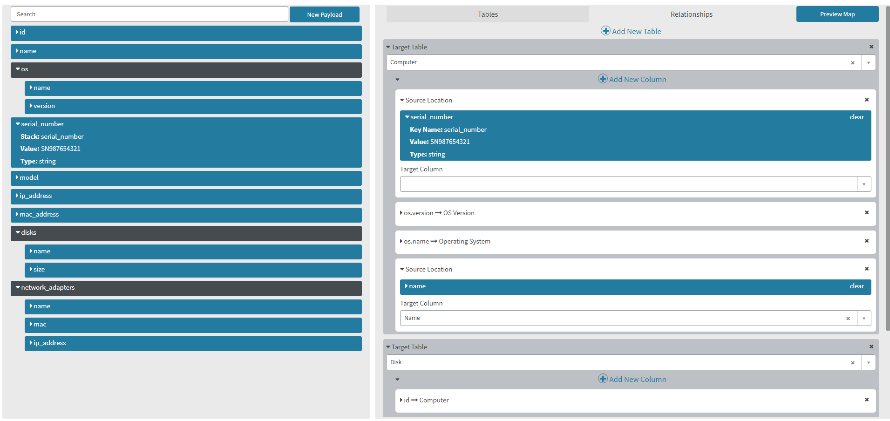
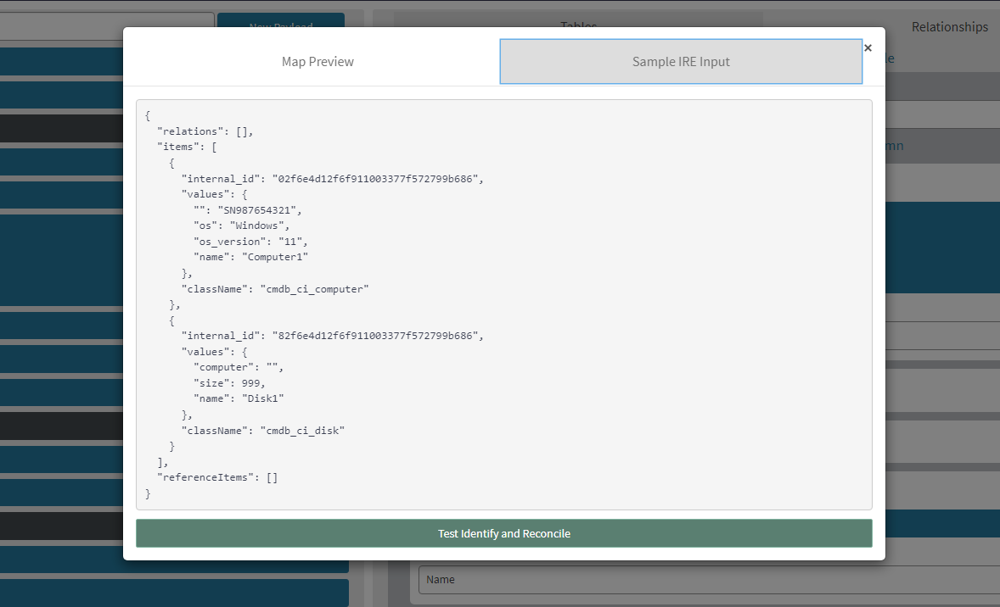

# JSON to IRE

Import JSON objects into a custom Service Portal UI that allows you to map properties from the object into a valid payload that can be submitted to the Identification and Reconciliation Engine (IRE)

The story behind this project goes back to when the IRE was fairly new in ServiceNow. Not a lot of people were able to use it because the IntegrationHub ETL & Robust Transform Engine didn't exist yet. I wanted to spend some time learning about the IRE and also get my feet wet in some deep Service Portal widget creations. This is absolutely not even close to a 1 to 1 replacement of ServiceNow's IntegrationHub ETL although the idea of mapping example source data and simulating the transform is all there funnily enough. The ETL just lets you use the full functionality of the IRE while this tool is a bit more simplistic.  That being said. the JSON to IRE app is not in a finished state and I've left it on the shelf once the RTE and ETL were released.

